# European Renewable Energy Analytics Platform

[](https://www.python.org/)
[](https://kestra.io/)
[](https://www.getdbt.com/)
[](https://cloud.google.com/bigquery)
[](https://cloud.google.com/)
[](https://www.terraform.io/)
[](https://datastudio.google.com/s/vF4ZYgjCcTc)

> "Europe says it's going green. Let's measure it."

Data engineering platform that ingests European electricity grid data (ENTSO-E) and meteorological observations (ERA5), transforms them into a dimensional analytics model, and surfaces actionable energy insights. Supports `DE`, `DK`, `ES`, `FR`, `GR`, `IT`, `PL`, `SE`. Run a single country or all at once.

## Table of contents

- [European Renewable Energy Analytics Platform](#european-renewable-energy-analytics-platform)
  - [Table of contents](#table-of-contents)
  - [Problem statement and dataset](#problem-statement-and-dataset)
    - [Datasets](#datasets)
  - [Architecture](#architecture)
  - [Directory structure](#directory-structure)
  - [Prerequisites](#prerequisites)
  - [A. Fast path](#a-fast-path)
  - [B. Step-by-step setup](#b-step-by-step-setup)
    - [Get API keys first](#get-api-keys-first)
    - [Clone and install](#clone-and-install)
    - [Provision GCP with Terraform](#provision-gcp-with-terraform)
    - [Start Kestra](#start-kestra)
    - [Run the pipeline](#run-the-pipeline)
    - [Local dev path](#local-dev-path)
    - [Dashboard](#dashboard)
  - [Quick commands reference](#quick-commands-reference)
  - [Cleanup and destroy](#cleanup-and-destroy)
  - [Contributing](#contributing)

---

## Problem statement and dataset

European electricity grid data is publicly available, but it is scattered across APIs, formats, and update cadences that make cross-country comparison difficult.

This project answers questions such as:

- Which countries generate the most renewable energy relative to total output?
- How does wind and solar generation correlate with weather conditions?
- How do generation mixes shift across countries and seasons?
- Which countries are closest to their renewable targets?

To answer those questions reliably, the project builds a repeatable batch pipeline with explicit quality checks, curated warehouse models, and a dashboard backed by stable fact tables instead of ad hoc raw queries.

### Datasets

- [ENTSO-E Transparency Platform](https://transparency.entsoe.eu/): hourly electricity generation by fuel type (XML), covering `DE`, `DK`, `ES`, `FR`, `GR`, `IT`, `PL`, `SE`
- [ERA5 / Copernicus CDS](https://cds.climate.copernicus.eu/): daily reanalysis weather observations (NetCDF): wind speed, solar radiation, temperature

---

## Architecture

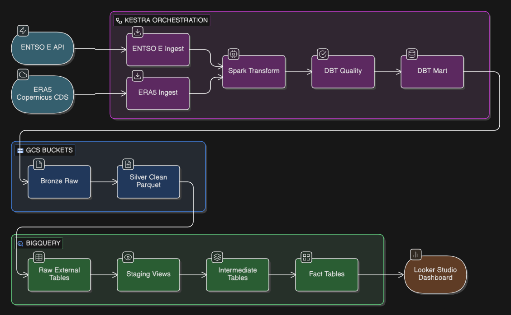

| Layer | Tool |
|-------|------|
| Infrastructure | Terraform (GCP) |
| Orchestration | Kestra |
| Ingestion | Python (ENTSO-E API, Copernicus CDS) |
| Processing | PySpark |
| Storage | GCS (bronze/silver), BigQuery |
| Transformation | dbt |
| Visualization | Looker Studio |

---

## Directory structure

```
├── docker-compose.yml              # Kestra + PostgreSQL
├── .env                            # API keys and GCP config (not committed)
├── .env.example
├── Makefile
│
├── infra/terraform/                # Terraform, GCP infra
│   ├── versions.tf
│   ├── providers.tf
│   ├── variables.tf
│   ├── locals.tf
│   ├── apis.tf                     # enables required GCP APIs
│   ├── service_accounts.tf         # pipeline service account
│   ├── iam.tf                      # IAM bindings (GCS + BQ + Secret Manager)
│   ├── secrets.tf                  # Secret Manager slots (empty, populated by Kestra)
│   ├── gcs.tf                      # GCS bucket
│   ├── bigquery.tf                 # BigQuery dataset: european_energy
│   ├── outputs.tf
│   └── terraform.tfvars.example
│
├── orchestration/
│   ├── config/
│   │   └── countries.json          # country names, ENTSO-E areas, ERA5 bounding boxes
│   ├── flows/                      # Kestra flow YAML definitions
│   │   ├── entsoe_ingest.yaml
│   │   ├── era5_ingest.yaml
│   │   ├── spark_transform.yaml
│   │   ├── daily_pipeline.yaml     # scheduled, runs automatically. Do not trigger manually
│   │   ├── backfill_pipeline.yaml  # manual historical replay, use this to populate data
│   │   ├── dbt_quality.yaml
│   │   ├── dbt_mart.yaml
│   │   ├── gcp_kv_setup.yaml       # one-time KV bootstrap (automated by make kestra-bootstrap)
│   │   └── gcp_setup.yaml          # creates GCS bucket + BQ dataset if they don't exist
│   └── scripts/
│       └── tasks/
│           ├── entsoe_fetch.py
│           └── era5_fetch.py
│
├── spark/
│   ├── scripts/
│   │   ├── entsoe_to_parquet.py    # local reference only, production parsing runs in spark_transform.yaml
│   │   └── era5_to_parquet.py      # local helper only, does not stamp a country column
│   └── utils/
│       ├── entsoe_xml_parser.py
│       └── era5_netcdf_helpers.py
│
├── transformations/                # dbt project (BigQuery)
│   ├── dbt_project.yml
│   ├── profiles.yml
│   ├── models/
│   │   ├── staging/                # views over raw external tables
│   │   ├── intermediate/           # business logic, joins, carbon intensity
│   │   └── mart/                   # dashboard-facing fact tables
│   ├── seeds/
│   └── tests/
│
├── dashboard/
│   └── queries/                    # Looker Studio SQL recipes
│
├── bronze/                         # Raw data (local mirror before GCS)
└── silver/                         # Clean Parquet (local mirror before GCS)
```

---

## Prerequisites

Install these tools before starting:

| Tool | Install |
|------|---------|
| `Make` | Required for the fast path (`make` commands) |
| `uv` (Python env manager) | `curl -LsSf https://astral.sh/uv/install.sh \| sh` · Full guide: https://docs.astral.sh/uv/getting-started/installation/ |
| Python 3.10+ | Managed by `uv`, no separate install needed |
| Docker + Docker Compose | https://docs.docker.com/get-docker/ |
| Google Cloud SDK (`gcloud`) | https://cloud.google.com/sdk/docs/install |
| Terraform 1.6+ | https://developer.hashicorp.com/terraform/install |
| Java 11+ | Only needed for local PySpark / notebook work |

---

## A. Fast path

Once prerequisites are installed and you already have API keys and a GCP project, the full fast setup is:

**1. Clone and install**

```bash
git clone https://github.com/dimzachar/european-power-observatory.git
cd european-power-observatory
make setup
```

**2. Fill in .env (API keys + GCP_PROJECT_ID + GCS_BUCKET)**

```bash
make env
nano .env
```

> [!IMPORTANT]
> ENTSO-E API approval takes 1-3 working days. Request access before anything else. See [Get API keys first](#get-api-keys-first).

**3. Provision GCP**: derives `environment` from `GCS_BUCKET` prefix in `.env`, generates terraform.tfvars, then applies. If `make infra` fails with `409 Already Exists`, you have existing GCP resources. Either delete them from the GCP console first, or manually import them into Terraform state. Check below for import commands.

```bash
make gcp-auth
make infra
```

**4. Download SA key and generate .env_encoded**

```bash
make sa-key
make encode-env
```

**5. Start Kestra, upload flows, push KV config**

```bash
make docker-up
```

See [Start Kestra](#start-kestra) for the full instructions.

- Flows load automatically. Go to `http://localhost:8080` → Flows → confirm the `european_energy` namespace is present.
- Run `gcp_kv_setup` then `gcp_setup` to bootstrap KV config and GCP resources.
- Run the pipeline (backfill your date range): `backfill_pipeline` → Triggers tab → Execute backfill → pick date range and country.

---

## B. Step-by-step setup

### Get API keys first

**ENTSO-E** (1-3 working days, request this now):
1. Register at https://www.entsoe.eu/
2. Email `transparency@entsoe.eu`, subject: `Restful API access`, include your registration email
3. Once approved: My Account Settings → Generate API Token

**ERA5 / Copernicus CDS** (immediate):
1. Register at https://cds.climate.copernicus.eu/
2. Copy your API token from your profile
3. Accept Terms of Use at https://cds.climate.copernicus.eu/cdsapp#!/dataset/reanalysis-era5-single-levels (scroll to bottom of the form)

---

### Clone and install

```bash
git clone https://github.com/dimzachar/european-power-observatory.git
cd european-power-observatory
uv sync
uv run dbt deps --project-dir transformations --profiles-dir transformations
```

Copy and fill `.env`:

```bash
cp .env.example .env
```

```
ENTSOE_API_KEY=your_api_token_here
CDSAPI_URL=https://cds.climate.copernicus.eu/api
CDSAPI_KEY=your_cds_api_key_here
GCP_PROJECT_ID=your-gcp-project-id
GCP_REGION=europe-west4
GCS_BUCKET=dev-renewable-energy-europe   # prefix (dev/prod/etc.) drives the Terraform environment
COUNTRY=GR
START_DATE=2025-03-01
END_DATE=2025-03-07
```
---

### Provision GCP with Terraform

Terraform creates everything: service account, GCS bucket, BigQuery dataset, and Secret Manager slots. You need zero manually created GCP resources.

**Authenticate:**

```bash
gcloud auth login
gcloud config set project YOUR_GCP_PROJECT_ID
gcloud auth application-default login
gcloud auth application-default set-quota-project YOUR_GCP_PROJECT_ID
```


> [!NOTE]
> **Why login twice?** `gcloud auth login` authenticates your user account for gcloud CLI commands (like `gcloud storage` or `gcloud iam`). `gcloud auth application-default login` sets up Application Default Credentials (ADC) used by client libraries, SDKs, and Terraform's Google provider under the hood. Both are needed for local setup.

**Configure tfvars:**

```bash
cd infra/terraform
cp terraform.tfvars.example terraform.tfvars
```

Edit `terraform.tfvars`, set at minimum:

```hcl
project_id  = "your-gcp-project-id"
environment = "dev"   # bucket will be named: dev-renewable-energy-europe
```

> [!IMPORTANT]
> `environment` in `terraform.tfvars` and the prefix of `GCS_BUCKET` in `.env` must match.
> - `environment = "dev"` → Terraform creates `dev-renewable-energy-europe` → set `GCS_BUCKET=dev-renewable-energy-europe`
> - `environment = "prod"` → Terraform creates `prod-renewable-energy-europe` → set `GCS_BUCKET=prod-renewable-energy-europe`
>
> If they differ, your flows will point at a bucket that doesn't exist.

**Apply:**

```bash
terraform init && terraform apply -auto-approve -var="environment=dev"
cd ../..
```

<details>
<summary>What Terraform creates</summary>

- Required GCP APIs enabled
- Service account `european-energy-pipeline` with GCS, BigQuery, and Secret Manager permissions
- GCS bucket `{environment}-renewable-energy-europe`
- BigQuery dataset `european_energy`
- Secret Manager slots (empty, populated via `.env_encoded` at Kestra startup)

</details>

<details>
<summary>If terraform apply fails with 409 Already Exists</summary>

Import the existing resources into Terraform state first. Only import resources that are **not** already in state. Check first:

```bash
cd infra/terraform
terraform init
terraform state list   # skip import for any resource already listed here
```

Then import only what's missing:

```bash
PROJECT_ID=$(grep '^GCP_PROJECT_ID=' .env | cut -d= -f2 | tr -d '[:space:]')
BUCKET=$(grep '^GCS_BUCKET=' .env | cut -d= -f2 | tr -d '[:space:]')

# Run only the lines for resources NOT in terraform state list
terraform import google_bigquery_dataset.european_energy ${PROJECT_ID}/european_energy
terraform import google_storage_bucket.main ${BUCKET}
terraform import google_service_account.pipeline projects/${PROJECT_ID}/serviceAccounts/european-energy-pipeline@${PROJECT_ID}.iam.gserviceaccount.com

terraform plan   # verify: no replacements or deletions
terraform apply -auto-approve
cd ../..
```

</details>

**Download the service account key:**

```bash
SA_EMAIL=$(cd infra/terraform && terraform output -raw pipeline_service_account_email)
gcloud iam service-accounts keys create service-account.json --iam-account=$SA_EMAIL
```

> [!IMPORTANT]
> `service-account.json` is in `.gitignore`. Never commit it.

**Generate `.env_encoded`:**

```bash
echo SECRET_GCP_SERVICE_ACCOUNT=$(cat service-account.json | base64 -w 0) > .env_encoded
echo SECRET_ENTSOE_API_KEY=$(echo -n "$ENTSOE_API_KEY" | base64 -w 0) >> .env_encoded
echo SECRET_CDSAPI_KEY=$(echo -n "$CDSAPI_KEY" | base64 -w 0) >> .env_encoded
```


---

### Start Kestra

```bash
docker compose up -d
```

Kestra starts at `http://localhost:8080`.

> [!NOTE]
> Default login: `admin@kestra.io` / `Admin1234!`
> To change the credentials, update the values in `docker-compose.yml` before starting the container.

All flows in `orchestration/flows/` are loaded automatically at startup via `--flow-path`. No manual import needed.

Push KV config and create GCP resources using the two bootstrap flows:

1. In the Kestra UI, open flow `gcp_kv_setup` (Step 1 of 2).
   Edit the inputs at the top of the flow, replace the three placeholders with your actual values:
   - `YOUR_GCP_PROJECT_ID` → your GCP project ID
   - `YOUR_BUCKET_NAME` → your GCS bucket name (must match `GCS_BUCKET` in `.env`)
   - `YOUR_GCP_REGION` → your GCP region (e.g. `europe-west4`)

   Then execute the flow. This populates the KV store that all other flows depend on.

   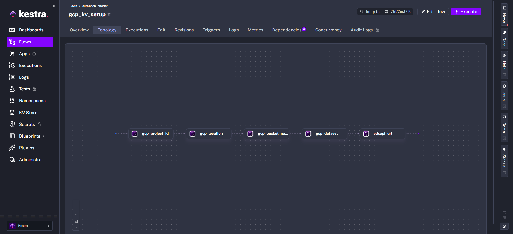

2. Open flow `gcp_setup` (Step 2 of 2) and execute it.
   This creates the GCS bucket and BigQuery dataset. If you already ran Terraform, it skips creation safely (`ifExists: SKIP`). Still run it to confirm connectivity.

   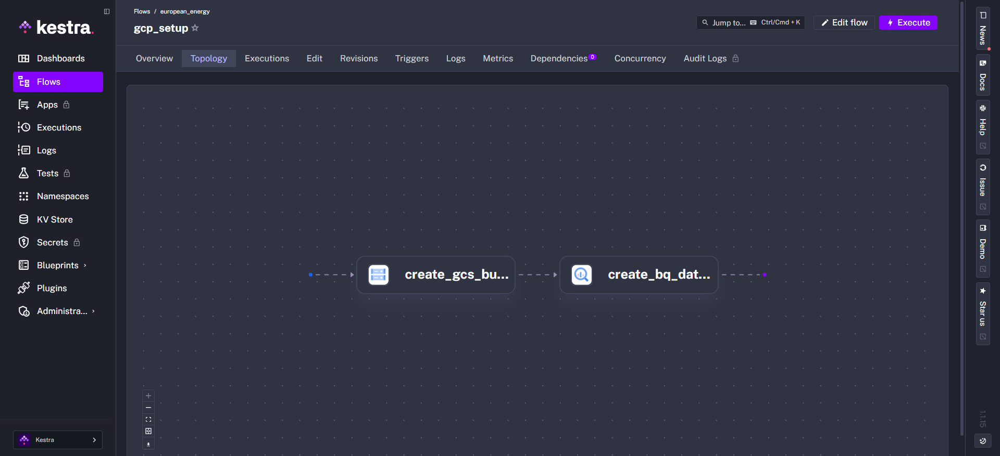

> [!NOTE]
> If you ran Terraform, skip `gcp_setup`. Bucket and dataset already exist. `gcp_setup` is only needed if you created GCP resources manually without Terraform.

---

### Run the pipeline

Use `backfill_pipeline` to populate historical data. `daily_pipeline` runs on a schedule automatically, do not trigger it manually.

1. Go to `http://localhost:8080` → Flows (the `european_energy` namespace will be pre-selected)
2. Open `backfill_pipeline` → Triggers tab → click "Execute backfill"

   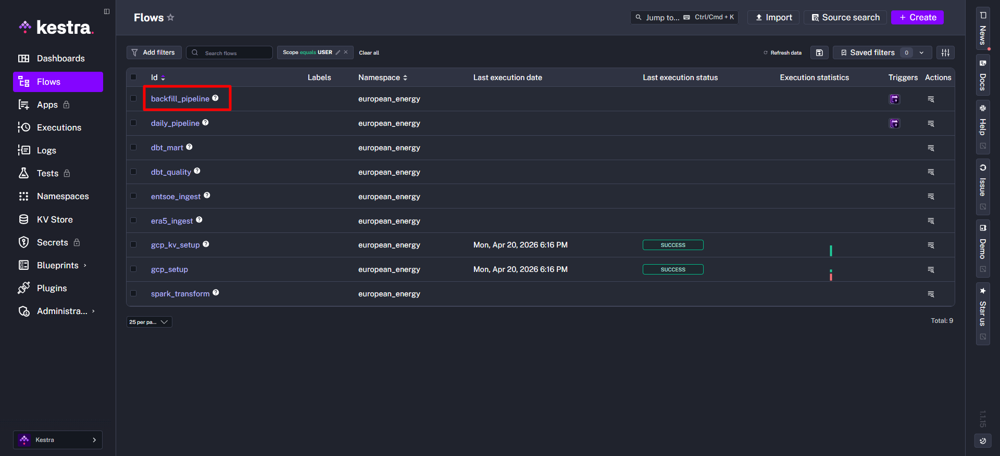

   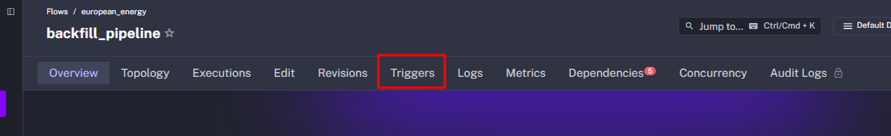

3. Select your date range and country

   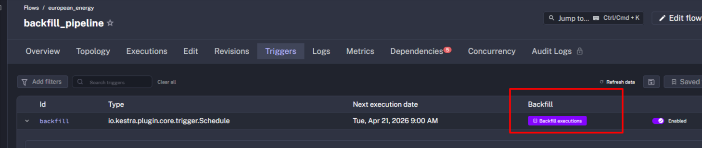

   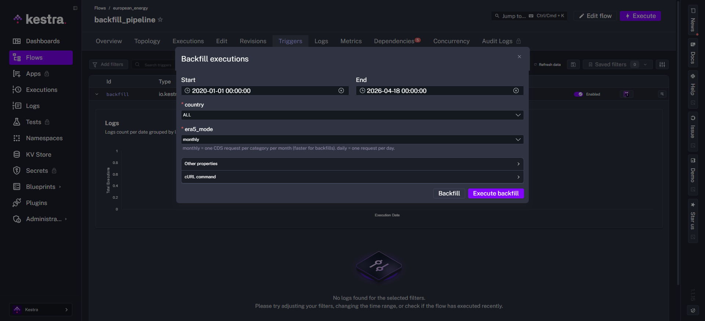

4. Monitor execution progress

   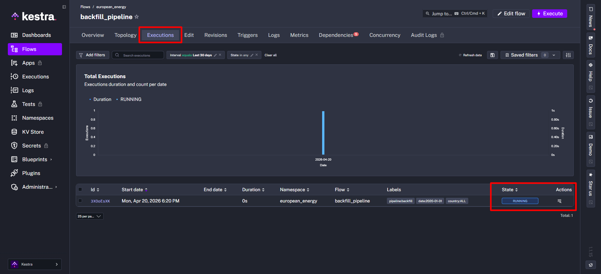

   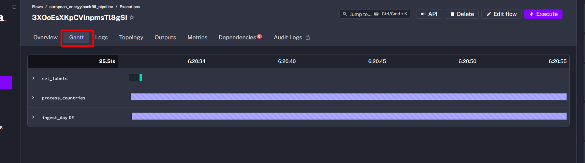

Kestra is the orchestrator that ties every step together. The backfill chains all five flows in order:

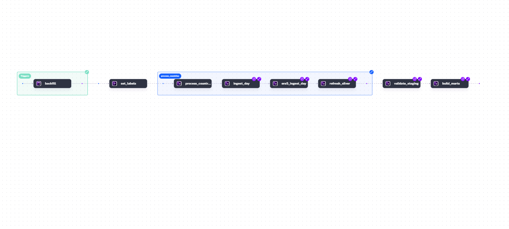
```
entsoe_ingest → era5_ingest → spark_transform → dbt_quality → dbt_mart
```

| Flow | What it does |
|------|-------------|
| `entsoe_ingest` | Fetches raw XML from the ENTSO-E API → GCS bronze |
| `era5_ingest` | Fetches raw NetCDF from Copernicus CDS → GCS bronze |
| `spark_transform` | Runs PySpark to parse bronze → clean Parquet → GCS silver |
| `dbt_quality` | Refreshes raw external tables in BigQuery, builds and tests staging models |
| `dbt_mart` | Seeds dimension tables, builds and tests intermediate and mart models |

**Spark** (`spark_transform`) handles the format conversion that SQL can't do cheaply. For ENTSO-E it parses IEC 62325 MarketDocument XML — walking each `TimeSeries`, resolving PSR type codes (`B16` → `solar`, `B19` → `wind_onshore`), and reconstructing absolute UTC timestamps from period start + position offset. The full list of `PsrType` codes used in this repo (`B01`–`B20`) is documented in [`docs/entsoe-psr-codes.md`](docs/entsoe-psr-codes.md). For ERA5 it flattens 3-D NetCDF variables (time × lat × lon) into long-format Parquet. Both jobs read from `gs://bronze/` and write partitioned Parquet to `gs://silver/`. The local scripts in `spark/scripts/` mirror this logic for dev use; `spark/utils/` holds the shared XML and NetCDF parsing helpers.

**dbt** (`dbt_quality` + `dbt_mart`) runs against BigQuery and is split into three layers, all targeting the single `european_energy` dataset:

- Staging (views) — thin wrappers over the GCS silver external tables: cast types, deduplicate on `(ts_hour, country_code, energy_source)`, add `date_key` and `hour_of_day`. No business logic, just clean inputs.
- Intermediate (tables) — business logic and cross-source joins: `int_daily_generation` aggregates hourly MW to daily totals and share-of-total per source; `int_generation_weather_join` aligns generation with ERA5 observations; `int_carbon_intensity` estimates hourly gCO₂/kWh per country using standard emission factors per fuel type.
- Mart (tables) — dashboard-facing fact tables that Looker Studio queries directly: `fct_renewable_kpi` (daily renewable % and MWh per country) and `fct_grid_carbon_intensity` (daily carbon intensity with cleanest/dirtiest hour context per country).

`dbt_quality` runs first and fails the pipeline if staging tests do not pass, so bad source data never reaches the mart.

To run steps individually instead of through `backfill_pipeline`, trigger any of the flows above directly from the Kestra UI.

---

### Local dev path

For testing individual steps without Kestra:

```bash
# Ingestion
make entsoe-ingest   # reads COUNTRY, START_DATE, END_DATE from .env
make era5-ingest

# dbt
make dbt-run
make test

# Local Spark notebook (requires: uv sync --group notebook)
uv run --group notebook jupyter lab spark/notebooks/renewable_energy_local_spark.ipynb
```

If your local `bronze/` is empty, sync a sample day from GCS first:

```bash
gcloud storage cp "gs://$GCS_BUCKET/bronze/entsoe/GR/generation/2025-03-01/generation.xml" \
  bronze/entsoe/GR/generation/2025-03-01/generation.xml
gcloud storage cp "gs://$GCS_BUCKET/bronze/era5/GR/2025/03/2025-03-01_*.nc" \
  bronze/era5/GR/2025/03/
```

For dbt authentication locally, use one of:
- `export GCP_SERVICE_ACCOUNT_PATH=/absolute/path/to/service-account.json`
- or `gcloud auth application-default login` (ADC, no keyfile needed)

---

### Dashboard

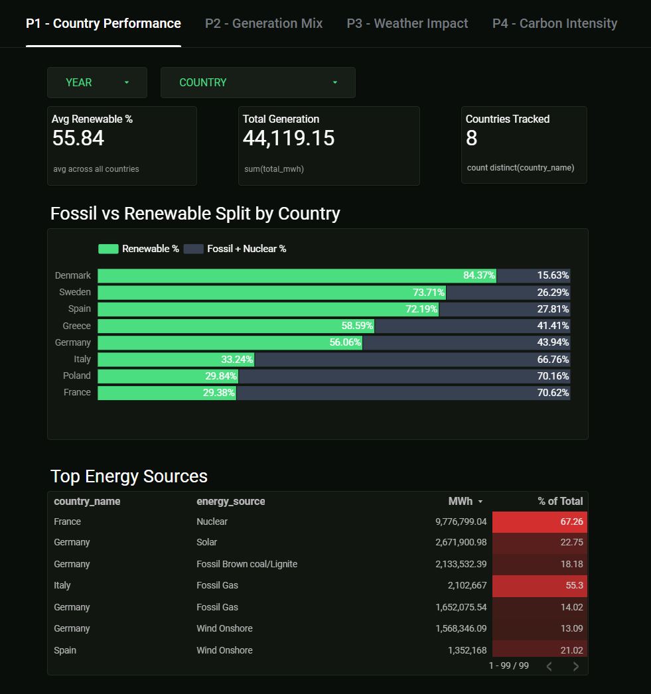

**Live Dashboard:** https://datastudio.google.com/s/vF4ZYgjCcTc

Full step-by-step instructions for building the Looker Studio report are in [`dashboard/looker-studio-guide.md`](dashboard/looker-studio-guide.md).

**Quick start:**

1. Go to https://lookerstudio.google.com/ → Create → Data Source → BigQuery
2. Select your GCP project, dataset `european_energy`, connect and create report
3. Use the SQL files in [`dashboard/queries/`](dashboard/queries/) as custom query data sources where needed

The guide covers four report pages: Country Performance, Generation Mix, Weather Impact, and Carbon Intensity with exact chart types, dimensions, metrics, and style settings for each.

Warehouse sanity check (run in BigQuery console or `bq` CLI):

```sql
SELECT
  MAX(date_key)      AS latest_date,
  SUM(total_mwh)     AS total_mwh,
  SUM(renewable_mwh) AS renewable_mwh
FROM `YOUR_GCP_PROJECT.european_energy.fct_renewable_kpi`;
```

---

## Quick commands reference

```bash
make env              # copy .env.example → .env
make setup            # uv sync + dbt deps
make infra            # terraform init + apply
make sa-key           # download SA JSON key (after terraform apply)
make encode-env       # generate .env_encoded from .env + service-account.json
make docker-up        # start Kestra at localhost:8080
make docker-down      # stop Kestra
```

---

## Cleanup and destroy

```bash
docker compose down
cd infra/terraform && terraform destroy
```

<details>
<summary>What this removes</summary>

- GCS bucket (and all data in it)
- BigQuery dataset `european_energy` and all tables
- Service account `european-energy-pipeline`
- All Secret Manager secrets

</details>

---

## Contributing

Contributions are welcome, especially around data quality, pipeline reliability, testing, and deployment hardening.

<details>
<summary>Before opening a PR</summary>

1. Keep the change focused on one concern
2. Run `uv sync` if dependencies changed
3. Run `dbt deps` and `dbt ls` to verify models load
4. Run `dbt run` and `dbt test` to verify models build and pass tests
5. In the PR description, include the purpose of the change, touched paths, and validation commands you ran

For larger changes, opening an issue first is the best way to align on scope before implementation.
</details>
